<div align="center">

<!-- ====== CYBERPUNK ANIMATED HEADER ====== -->


<!-- ====== TYPING ANIMATION ====== -->
[](https://git.io/typing-svg)

<br/>

<!-- ====== BADGES ====== -->


</div>

---

## 🧠 Who Am I?

```bash
$ whoami
```

```yaml
Name       : Arvind
Role       : DevOps Engineer
Location   : Bengaluru, India 🇮🇳
Focus      : CI/CD · Containers · Cloud Infrastructure · Automation
Status     : Actively building. Actively learning. Not stopping.
```

> *"I don't just support the cloud — I architect, automate, and own it."*

---

## 🛠️ Tech Stack

<div align="center">

### ☁️ Cloud & Infrastructure


### 🐳 Containers & Orchestration


### ⚙️ DevOps & Automation


### 💻 Scripting & Tools


### 📊 Monitoring & Observability


</div>

---

## 🚀 Projects

<table>
  <tr>
    <td width="50%">
      <h3>⚙️ CI/CD Pipeline with GitHub Actions</h3>
      <p>Built an end-to-end CI/CD pipeline for a Node.js app — automated testing, Docker image build, and deploy to AWS EC2 on every push to main.</p>
      
      
      
    </td>
    <td width="50%">
      <h3>🏗️ AWS Infrastructure with Terraform</h3>
      <p>Provisioned a fully automated AWS environment (VPC, EC2, S3, IAM) using Terraform — 100% infrastructure-as-code, zero manual clicks.</p>
      
      
    </td>
  </tr>
  <tr>
    <td width="50%">
      <h3>🐳 Dockerized Microservices App</h3>
      <p>Containerized a multi-service application using Docker Compose. Configured service networking, volume mounts, and environment-based configs.</p>
      
      
    </td>
    <td width="50%">
      <h3>📊 K8s Monitoring Stack (Prometheus + Grafana)</h3>
      <p>Deployed a Prometheus + Grafana monitoring stack on a local Kubernetes cluster. Created custom dashboards for pod health, CPU, and memory metrics.</p>
      
      
      
    </td>
  </tr>
</table>

---

## 📊 GitHub Stats

<div align="center">


</div>

<div align="center">

[](https://git.io/streak-stats)

</div>

---

## 🐍 Contribution Graph

<div align="center">
  <picture>
    <source media="(prefers-color-scheme: dark)" srcset="https://raw.githubusercontent.com/iam-arvindd/iam-arvindd/output/github-contribution-grid-snake-dark.svg"/>
    <source media="(prefers-color-scheme: light)" srcset="https://raw.githubusercontent.com/iam-arvindd/iam-arvindd/output/github-contribution-grid-snake.svg"/>
    
  </picture>
</div>

---

## 🤝 Connect with Me

<div align="center">

[](https://linkedin.com/in/arvind-singhh)
[](https://instagram.com/arvnd_singhh)
[](https://github.com/iam-arvindd)

</div>

---

<div align="center">


</div>
